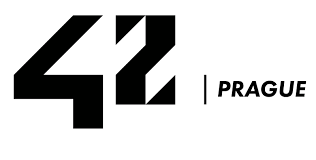

---
42Prague is an innovative coding school that allows students a self-paced study. It offers a project-based approach for students to learn programming through collaborative, peer-to-peer environment.

